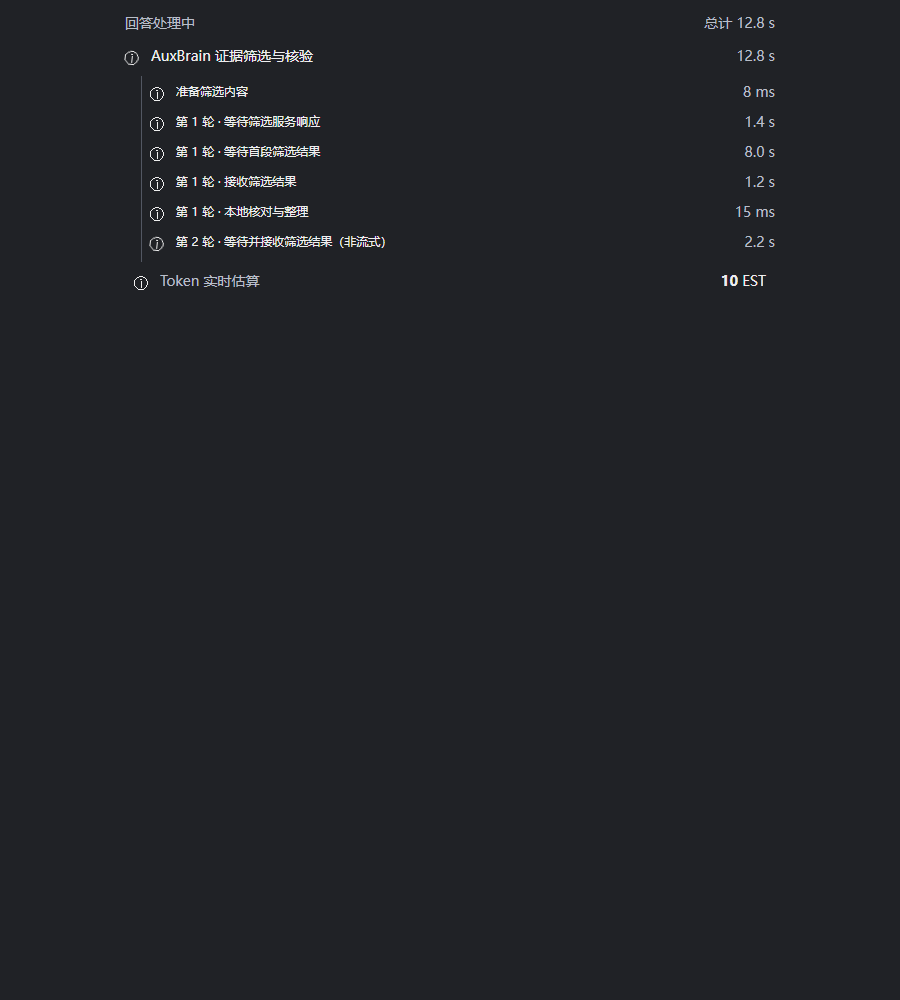

# AuxBrain v0.11.2 使用教程

## 1. 载入论文

把带文字层的 PDF 拖入 Obsidian 文件列表，点击打开；Markdown 同样支持。全文提问不需要先选中句子。没有文字层的扫描 PDF 应先 OCR，本版不承诺图片和表格视觉解析。

尚未载入时，在当前文档右键选择 **为当前文档载入AuxBrain**。也可以使用侧栏图标或 `Ctrl+P` 的 **向当前文档提问**。当前论文已载入或正在载入时，右键不重复显示载入选项；选中文字仍可通过 **加入 AuxBrain** 标注。

核对 AuxBrain 顶部的论文名。切换论文后，标题和该论文的问题历史跟随变化；问答或写入进行中会等原任务结束再切换，避免串论文。

## 2. 设置回答模式

第一次未配置 Key 时会提示设置。以后点击主面板 **回答模式**，在弹窗内选择模式、供应商和模型。

- **AuxBrain**：分层证据筛选、LLM 回答和证据核验，一次问题可能请求模型多次。
- **LLM-Only**：仅 LLM 路径，不显示 AuxBrain 校正阶段。
- **声明**：查看服务适用范围、费用和隐私。套餐技术上连通不等于允许此用途。
- **保存 Key**：仅保存到本机凭据服务，不调用模型。
- **测试连接**：主动发送短测试提示，不含论文，但可能消耗额度。

不想继续输入 Key 时使用左上角返回入口。空白输入不覆盖已有 Key；不要把密钥发进反馈截图。

## 3. 提出细粒度问题

例如打开 `OrthoSkillVLA.pdf` 后输入以下问题。本例是问题模板，不是已经核验的论文结论：

> 这篇论文用了哪些真机测试？分别说明机器人平台、任务、对比方法和主要结果；没有原文依据的部分请明确说明。

也可以拆开问：“训练用了哪些数据集？”“哪个消融实验支持模块 A 有效？”“相对 baseline 的改进在什么条件下成立？”

左侧个人问题和右侧推荐问题分开展示。推荐问题可填入输入框；个人历史显示次数与时间，简单归一化匹配会合并重复问题。填写后点击提交按钮。

问题及所需正文会发送到所选模型服务。耗时受文档规模、供应商排队、首段等待、输出长度和调用轮次影响。

## 4. 阅读细分进度

证据筛选现在展开显示准备内容，以及每轮的等待服务响应、等待首段结果、接收筛选结果、本地核对与整理。运行中显示动态标识和计时，完成后停止计时。非流式接口诚实地合并等待与接收。

**【插图位置 1：紧跟细分进度说明。以下为 0.11.2 组件、虚构耗时的浏览器验证图，不是真实模型请求。】**

父阶段耗时包含子阶段，不能把两层数字累加。“等待首段”不等于知道模型内部何时开始思考。Token 实时值可能是估算，最终统计取决于供应商返回，不能替代账单。

## 5. 看答案，更要看依据

回答后点击 **查看AuxBrain回答依据**，默认 TOP-1，TOP-N 数量在这里选择，不占用主面板。点击原文定位入口检查对应页、句子高亮和上下文。置信度不是正确性保证。

如果答案包含论文、段落、句子标识或括号引用，它们是溯源标识，不是额外事实。若出现“人工召回”“开放子问没有命中”等诊断，表示当前检索路径或子问题证据覆盖情况，不必然代表全文没有相关内容。请拆分问题并查看证据，不能把未命中解释为论文明确否定。

## 6. 认可或纠正

认可且核验后，点赞会触发知识写入；请等待写入进度完成。点赞不是只记录喜好的按钮。

需要纠正时，进入依据页点击 **我要修正**。页面保留证据原句和一个理解输入框。示例表达方式：“这里的 Dataset A 是训练数据，Dataset B 是评测数据，不能把二者都标成训练数据。”这是写法示例，不应作为该论文事实入库。

提交理解、解析关系、核对结果，再确认入库。改动理解文本后重新解析。返回时用左上角返回入口。也可选中 PDF 原句，右键 **加入 AuxBrain** 直接进行人工标注。

问答与前台入库保持互斥，按钮忙碌时不要重复提交。后台卡片整理是另一项任务：问答完成不代表档案已经整理完成。候选条目和人工确认条目必须区分。

下一步：[个人论文知识库](03-个人论文知识库.md)。
