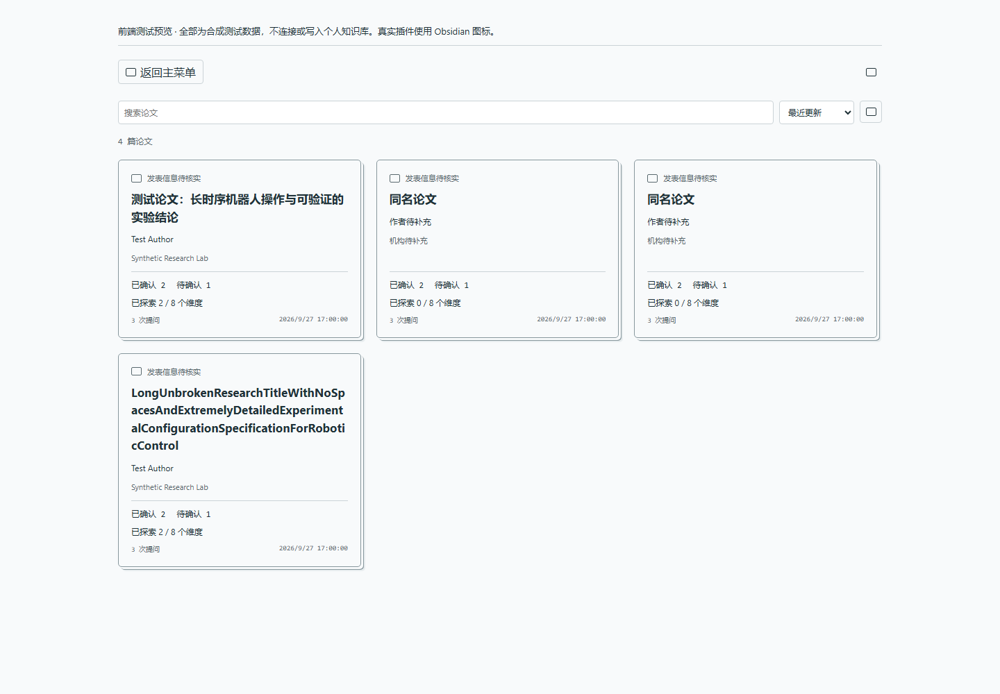
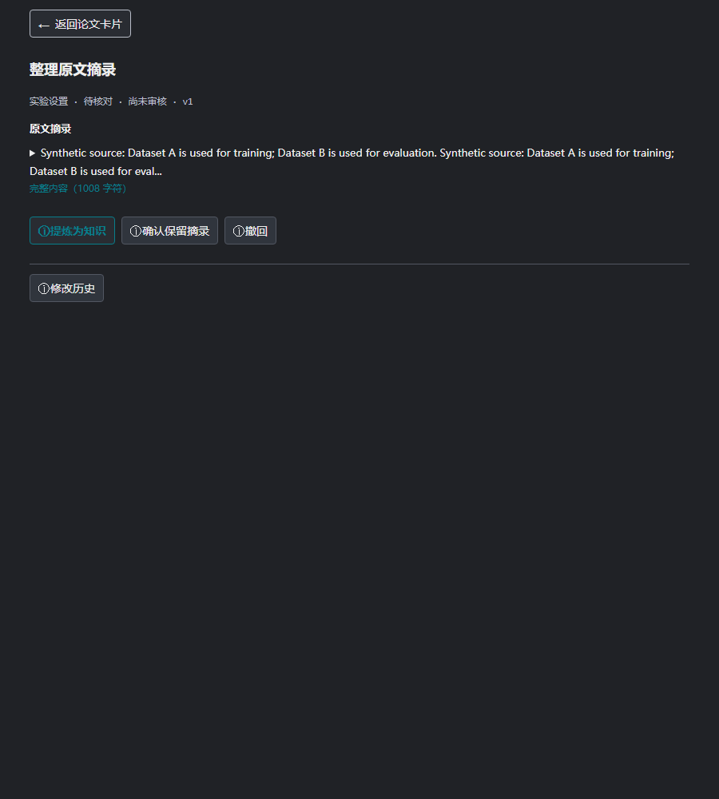
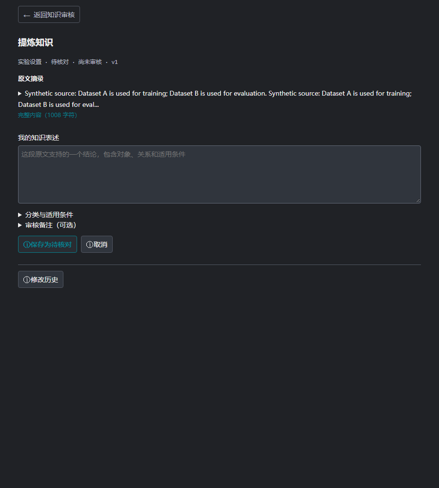

# AuxBrain v0.11.2 个人论文知识库

## 从主面板进入

点击 **查看数据库** 打开按论文组织的卡片。每张卡片对应一篇论文，单色、边缘伪 3D 样式；列表可搜索、排序和翻页。初次安装是个人空库，不会带上开发者的论文或测试数据。原关系图仍可从 **查看原知识图谱** 进入。

**【插图位置 2：卡片入口说明之后。以下为 0.11.2 组件与虚构论文数据的浏览器验证图，不是用户数据库截图。】**

## 一篇论文的三个视图

| 视图 | 内容 | 注意事项 |
| --- | --- | --- |
| 基本信息 | 标题、arXiv、作者、单位、版本日期、发表信息及来源 | 只展示已记录字段，空缺不等于未发表，不静默补齐 |
| 结构化知识 | 八个固定维度及其中的知识条目、状态、证据 | 候选不等于人工确认，允许修正或撤回 |
| 提问贡献 | 每次提问新增、补证、修正、首次披露、无新增等变化 | 未完成的后台整理不能当成零贡献 |

八个维度：研究背景、相关工作、相对改进、本文方案、实验设置、主要结果、消融实验、局限与未来工作。卡片逐步披露已有内容，不要求一次提问生成整篇总结。“已探索 X/8”是记录覆盖情况，不是论文理解完成度或答案准确率。

“档案关联提问”只统计关联该档案的问题；它与主面板历史总次数的口径不同，历史迁移和未关联问题会造成差异。

## 原文证据在哪里

1. 打开论文卡片，进入 **结构化知识**。
2. 顶部点击 **查看原文证据**，展开可用的证据条目；也可手动展开某条知识的 **原文证据**。
3. 点击条目中的页码或原文定位入口，回到已关联的本地文档查看上下文。
4. 若历史记录缺少坐标，在知识条目操作区点击 **关联本地原文**，选择对应本地文件完成核对。

没有证据时入口会不可用。关联操作并非任意指定位置：文件与文本快照需要匹配，正文变化、找不到句子或重复句歧义会阻止不可靠跳转。不要把同名 PDF 当成同一版本。

## 审核与记忆

### 为什么以前是一大段

默认后台采用原文摘录：把证据句段直接存成候选，不会为了提炼另行调用云端模型。它是一条有来源的材料，不一定已是简短知识。旧界面把这段材料作为“知识”和“证据”各展示一次，容易造成误解。

现在列表区分 **原文摘录** 与 **知识表述**，候选状态显示 **待核对**。超过 240 字符的内容默认折叠，只展示截取的开头；这是原文预览，不是自动摘要，不会删除数据库里的全文。

### 整理一段摘录

点击有边框的 **整理这段摘录** 按钮。原文只展示一次，长段可以展开全文。

**【插图位置 3：整理入口说明之后。0.11.2 组件与虚构原文，不是真实论文。】**

- **提炼为知识**：进入单个主要输入框“我的知识表述”。对于长段原文，输入框留空，写下一个有原文支持的结论，保留必要条件，不必重复粘贴全文。
- **确认保留摘录**：明确希望保留完整引用时使用，不把它伪装成一句提炼结论。
- **撤回**：不想保留为有效知识时使用，历史仍然保留。

**【插图位置 4：提炼输入框说明之后。0.11.2 组件、空白输入框与虚构原文。】**

分类、适用条件和备注放在折叠区域，原栏目和条件默认保留。点击 **保存为待核对** 创建修正条目；旧条目撤回但不删除。新表述仍需单独确认，不因为保存就获得人工认可。

### 确认的是什么

已有知识表述通过 **核对这条知识** 进入。核对的是这条表述是否有证据支持、归属栏目是否正确，以及对象、训练或评测阶段、数据集、平台、数字和适用条件有没有被扩大或混淆。

正确时选择 **确认这条知识 → 确认并保存**。不准确时选择 **修改表述**；只确认自己核对过的内容，不代表为整篇论文的科学有效性背书。

通过提问整理出的内容可以先作为候选保留，但不是自动认可。核对原文后进行确认、修正或撤回。发生版本冲突或网络结果不明时，先重新读取当前状态，不要盲目重复写入。

AuxBrain 可在同一论文版本的后续问答中使用符合条件的已确认知识；撤回或过期条目不继续作为有效记忆。不是无条件把整个个人库加入每个问题，也不意味着候选回答已变成确定事实。

默认后台整理采用本地摘录，独立于前台 LLM 下拉选项。后台 LLM 整理需要单独启用与授权，详见 [服务商与隐私](05-服务商与隐私.md)。
